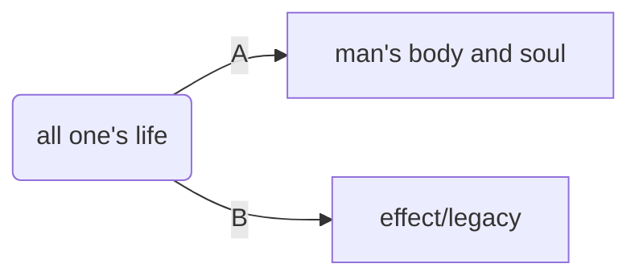

# 设计你所喜爱的人生（阅读中）

**Design the Life you love**

a step-by-step guide to building a meaningful future

[美] Ayse Birsel 著

项目：我的人生

设计流程：解构、重构

## 如何使用

* 花20分钟写写画画, 第二天再继续。
* 没有所谓的错误答案，只有“你的答案”。
* enjoy yourself.

想想怎么在“你需要的”和“你想要的”之间创造交集。（例如你想要去旅行，但是你需要赚钱）。创意就可以在这里发挥作用，让这两个方面共存.

不断问自己“假如……会怎么样？”，并且认真对待自己的回答。

### 第一步：分解

> 把每个问题都分解为很多部分，让解决它变得必要且可行。

书中按照列清单，画脑图的方式举例了多种人生解构，如`工作` `家庭` `健康` `朋友` `兴趣`；如`情感` `物质`  `智力` `精神`；下面按照东方思维的习惯，用一生二，二生三，三生万物的方式来分：

A：生而为人，自然而然的部分。The human body which God gave us!

B：痕迹，遗留下的物质、精神。 legacy.

C：造化万物，那遁去的一。

哈哈，我这么分后面怎么搞。

第二步：观点

> 任何事物，其实都取决于我们怎么看待它。

